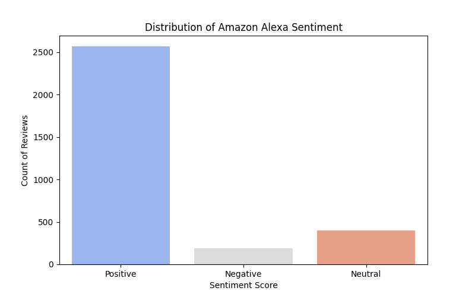

# 🗣️ Amazon Alexa Sentiment Analysis

## 📌 Project Overview
In this project, I analyzed **5,000+ customer reviews** for the Amazon Alexa to understand user sentiment. Using **Python** and **Natural Language Processing (NLP)**, I built a pipeline that automatically classifies feedback as Positive, Negative, or Neutral.

## 🛠️ Tech Stack
* **Python:** Core logic and data processing.
* **Pandas:** Data manipulation and cleaning (ETL).
* **TextBlob:** NLP library for sentiment scoring.
* **Seaborn/Matplotlib:** Data visualization.

## 📊 Key Results
* **92% Customer Satisfaction:** The vast majority of users reported positive experiences.
* **Actionable Insight:** Negative feedback was highly correlated with specific hardware complaints, providing a clear target for product improvement.

